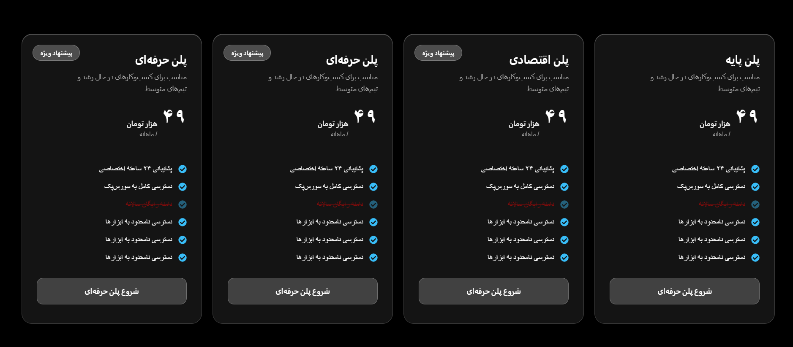

# Sepehr Elementor Widgets

> یک افزونه سفارشی برای Elementor که با معماری PHP شیءگرا و ساختاری ماژولار توسعه داده شده و بر ساخت ویجت‌های قابل استفاده مجدد، مدیریت منظم Assetها، تعاملات امن AJAX و نگهداری آسان کد تمرکز دارد.

[](https://wordpress.org/)
[](https://elementor.com/)
[](https://www.php.net/)
[](LICENSE)

---

## معرفی پروژه

**Sepehr Elementor Widgets** یک افزونه سفارشی برای Elementor است که به‌عنوان یک پروژه عملی در توسعه WordPress طراحی و پیاده‌سازی شده است.

ساختار افزونه بر پایه معماری ماژولار PHP و برنامه‌نویسی شیءگرا طراحی شده است؛ به‌گونه‌ای که مدیریت Widgetها، Assetها، سرویس‌های Core و راه‌اندازی افزونه از یکدیگر تفکیک شده‌اند.

تمرکز اصلی پروژه روی موارد زیر است:

* ساخت ویجت‌های قابل استفاده مجدد برای Elementor
* برنامه‌نویسی شیءگرا با PHP
* معماری ماژولار افزونه
* تعاملات AJAX
* مدیریت Assetهای CSS و JavaScript
* کنترل‌های Responsive در Elementor
* ساختار آماده برای ترجمه
* نگهداری و توسعه آسان کد

---

## ویژگی‌ها

### Dynamic Post Grid Pro

ویجت پیشرفته نمایش پست‌های وردپرس با قابلیت‌های پویا.

**ویژگی‌ها:**

* فیلتر دسته‌بندی با AJAX
* Load More با AJAX
* پشتیبانی از Custom Post Type
* تعیین تعداد پست‌ها در هر صفحه
* کنترل تعداد ستون‌ها در حالت Responsive
* امکان Include / Exclude دسته‌بندی‌ها
* طراحی Responsive
* استایل کارت Glassmorphism
* کنترل‌های قابل تنظیم در Elementor


---

### Pricing Table Pro

ویجت جدول قیمت برای طراحی صفحات خدمات و Landing Pageهای مدرن.

**ویژگی‌ها:**

* امکان ایجاد گزینه‌های مختلف قیمت‌گذاری
* تنظیم محتوای قیمت
* کنترل‌های Elementor
* طراحی Responsive
* تنظیم Typography
* کنترل‌های استایل



---

### Testimonial Carousel

ویجت Carousel برای نمایش نظرات و بازخورد مشتریان.

**ویژگی‌ها:**

* Carousel واکنش‌گرا
* تنظیم محتوای Testimonials
* پشتیبانی از تصویر
* کنترل‌های Elementor
* رفتار Responsive
* CSS و JavaScript اختصاصی


---

### Image Card

یک ویجت کارت تصویری قابل استفاده مجدد برای صفحات Landing، خدمات، Portfolio و بخش‌های تبلیغاتی.

**ویژگی‌ها:**

* پشتیبانی از تصویر
* عنوان و محتوای سفارشی
* طراحی Responsive
* کنترل‌های Elementor
* گزینه‌های استایل‌دهی


---

## معماری پروژه

این افزونه از یک ساختار ماژولار و مبتنی بر PHP OOP استفاده می‌کند.

```text
sepehr-elementor-widgets/
│
├── assets/
│   ├── css/
│   └── js/
│
├── includes/
│   ├── Autoloader.php
│   │
│   └── Core/
│       ├── Asset_Manager.php
│       ├── Plugin.php
│       └── Widget_Manager.php
│
├── languages/
│
├── screenshots/
│
├── widgets/
│
├── sepehr-elementor-widgets.php
├── README.md
├── README_FA.md
└── LICENSE
```

### وظیفه بخش‌های اصلی

| بخش                            | وظیفه                         |
| ------------------------------ | ----------------------------- |
| `sepehr-elementor-widgets.php` | نقطه ورود افزونه              |
| `Autoloader.php`               | بارگذاری کلاس‌ها              |
| `Plugin.php`                   | راه‌اندازی و Bootstrap افزونه |
| `Widget_Manager.php`           | ثبت Widgetهای Elementor       |
| `Asset_Manager.php`            | مدیریت CSS و JavaScript       |
| `widgets/`                     | کلاس‌های مربوط به Widgetها    |
| `assets/css/`                  | فایل‌های CSS                  |
| `assets/js/`                   | فایل‌های JavaScript           |
| `languages/`                   | فایل‌های ترجمه                |
| `screenshots/`                 | تصاویر مستندات پروژه          |

---

## اصول طراحی

### تفکیک مسئولیت‌ها

راه‌اندازی افزونه، ثبت Widgetها، مدیریت Assetها و پیاده‌سازی Widgetها از یکدیگر جدا شده‌اند.

### یک Widget، یک Class

هر Widget کلاس PHP مخصوص خود را دارد تا نگهداری و توسعه آن ساده‌تر باشد.

### ثبت متمرکز Widgetها

Widgetها از طریق `Widget_Manager` ثبت می‌شوند و هر Widget به‌صورت مستقل از چند نقطه مختلف پروژه مقداردهی نمی‌شود.

### مدیریت متمرکز Assetها

فایل‌های CSS و JavaScript از طریق `Asset_Manager` مدیریت می‌شوند.

### امنیت WordPress

در بخش‌های مختلف افزونه از استانداردهای امنیتی WordPress استفاده شده است، از جمله:

* جلوگیری از دسترسی مستقیم به فایل‌ها
* استفاده از APIهای WordPress
* Sanitization
* Escaping
* اعتبارسنجی Nonce در درخواست‌های AJAX در صورت نیاز
* کنترل درخواست‌های AJAX

---

## AJAX

برخی از Widgetها برای ایجاد تعاملات پویا بدون نیاز به Reload کامل صفحه از AJAX استفاده می‌کنند.

برای مثال، **Dynamic Post Grid Pro** از AJAX برای موارد زیر استفاده می‌کند:

* فیلتر دسته‌بندی‌ها
* بارگذاری پست‌های بیشتر

منطق تعاملات AJAX از لایه نمایش Widget جدا نگه داشته شده تا JavaScript مسئول تعاملات کاربر باشد و Widget مسئولیت نمایش محتوا را بر عهده داشته باشد.

---

## مدیریت Assetها

افزونه برای Widgetهایی که به رفتارهای Frontend نیاز دارند، از فایل‌های CSS و JavaScript اختصاصی استفاده می‌کند.

مدیریت Assetها به‌صورت متمرکز انجام می‌شود تا همه فایل‌ها بدون نیاز در تمام صفحات بارگذاری نشوند و ساختار پروژه تمیز و قابل نگهداری باقی بماند.

---

## اتصال به Elementor

Widgetها با استفاده از سیستم Widget بومی Elementor و کلاس زیر توسعه داده شده‌اند:

```php
Elementor\Widget_Base
```

کنترل‌های Widget نیز از API کنترل‌های Elementor استفاده می‌کنند تا کاربر بتواند محتوا و تنظیمات ظاهری Widget را مستقیماً از Elementor Editor مدیریت کند.

---

## نصب

### پیش‌نیازها

* WordPress
* Elementor
* PHP 8.x
* محیط استاندارد اجرای WordPress

### مراحل نصب

1. Repository را Clone یا Download کنید.

```bash
git clone https://github.com/sepehrwordpres/sepehr-elementor-widgets.git
```

2. افزونه را داخل مسیر زیر قرار دهید:

```text
wp-content/plugins/
```

3. وارد پنل مدیریت WordPress شوید.

4. به مسیر زیر بروید:

```text
Plugins → Installed Plugins
```

5. افزونه **Sepehr Elementor Widgets** را فعال کنید.

6. وارد Elementor شوید و از Widgetهای موجود استفاده کنید.

---

## توسعه پروژه

ساختار فعلی پروژه به‌گونه‌ای طراحی شده که بتوان Widgetهای جدید را به آن اضافه کرد.

برای اضافه‌کردن Widget جدید، کلاس مربوطه در پوشه زیر قرار می‌گیرد:

```text
widgets/
    New_Widget.php
```

سپس Widget از طریق:

```text
includes/Core/Widget_Manager.php
```

ثبت می‌شود.

Assetهای Frontend نیز از طریق:

```text
includes/Core/Asset_Manager.php
```

مدیریت می‌شوند.

این ساختار باعث می‌شود ثبت Widgetها و مدیریت Assetها به‌صورت متمرکز باقی بماند.

---

## هدف پروژه

اهداف اصلی این پروژه عبارت‌اند از:

* ساخت کامپوننت‌های قابل استفاده مجدد برای Elementor
* نمایش معماری حرفه‌ای توسعه افزونه WordPress
* تمرین و استفاده از PHP شیءگرا
* پیاده‌سازی تعاملات AJAX در Widgetهای Elementor
* جداسازی مناسب PHP، CSS و JavaScript
* ایجاد پایه‌ای قابل توسعه برای Widgetهای آینده

---

## توسعه‌های آینده

برخی از توسعه‌های احتمالی آینده پروژه:

* Widgetهای پیشرفته بیشتر
* کامپوننت‌های بیشتر مبتنی بر AJAX
* کنترل‌های استایل گسترده‌تر
* بهبود دسترسی‌پذیری
* بهینه‌سازی Performance
* گسترش قابلیت‌های ترجمه
* تست‌های خودکار
* رعایت استانداردهای کدنویسی WordPress
* مستندات عمومی گسترده‌تر

---

## تصاویر پروژه

تمام Screenshotهای پروژه در پوشه زیر قرار دارند:

```text
screenshots/
```

---

## توسعه‌دهنده

**Sepehr**

WordPress & PHP Developer

حوزه‌های فعالیت:

* WordPress Development
* Elementor Widget Development
* Custom Plugin Development
* PHP
* Laravel
* REST API
* SEO

---

## مجوز

این پروژه تحت مجوز **MIT License** منتشر شده است.

برای اطلاعات بیشتر فایل [LICENSE](LICENSE) را مشاهده کنید.
